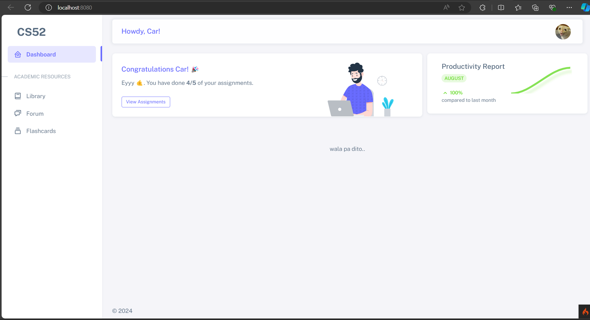

# CS52 Project

## Requirements

Download and install the following:

- [XAMPP](https://www.apachefriends.org/download.html) version 8.2.12 / PHP 8.2.12.
- [Composer](https://getcomposer.org/download/).
- [Git](https://git-scm.com/downloads) client.
- [Visual Studio Code](https://code.visualstudio.com/Download).

## Setup

1. Open the Git bash terminal. Navigate to the folder where you want to place the project (preferably inside
   the `xampp/htdocs/` folder).
   _(e.g.):_
   ```shell
   cd C:\xampp\htdocs
   ```
2. You may download or clone this repository using the command below. Just type it in the Git bash terminal:
    ```shell
    git clone https://github.com/tcc-npg/cs52.git
    ```

3. Go inside the project directory:
    ```shell
    cd cs52
    ```
4. Install dependencies:
   ```shell
   composer install
   ```
5. Rename the `env` file to `.env`:
   ```shell
   mv env .env
   ```
6. To run the app, type in:
    ```shell
   php spark serve
    ```
7. Open your browser and navigate to `http://localhost:8080`.



## Development

_to add_

## Development Guides

_to add_

## Modules

- Academic Resources Library
- Forums
- Activity Compiler
- _Fresh Start_
- Study Assistance
- ...