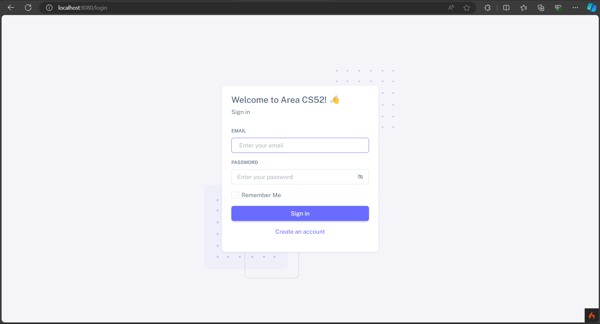
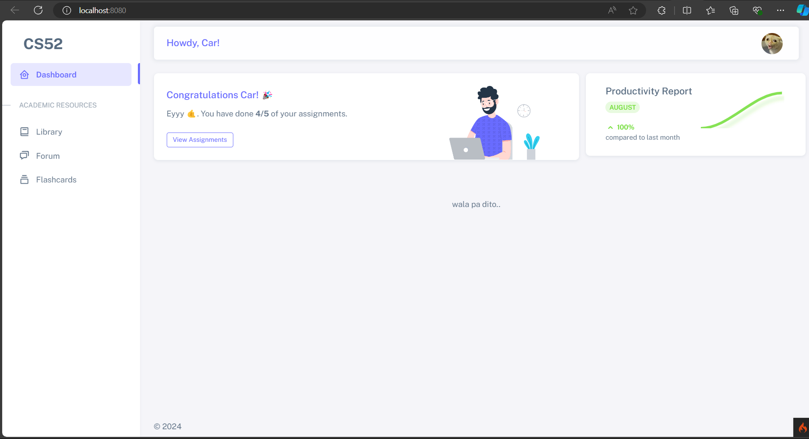

# CS52 Project

## Requirements

Download and install the following:

- [XAMPP](https://www.apachefriends.org/download.html) version 8.2.12 / PHP 8.2.12.
- [Composer](https://getcomposer.org/download/).
- [Git](https://git-scm.com/downloads) client.
- [Visual Studio Code](https://code.visualstudio.com/Download).

## Setup

1. Open the Git bash terminal. Navigate to the folder where you want to place the project (preferably inside
   the `xampp/htdocs/` folder).
   _(e.g.):_
   ```shell
   cd C:/xampp/htdocs
   ```
2. You may download or clone this repository using the command below. Just type it in the Git bash terminal:
    ```shell
    git clone https://github.com/tcc-npg/cs52.git
    ```
3. Go inside the project directory:
    ```shell
    cd cs52
    ```
4. Install dependencies:
   ```shell
   composer install
   ```
5. Rename the `env` file to `.env`:
   ```shell
   mv env .env
   ```
6. Start XAMPP and click the `Start` buttons of Apache and MySQL apps. Once successfully started, Click the `Admin`
   button of MySQL. This will open the browser and take you to `phpMyAdmin` page.
7. Once the page is loaded, click the `New` button located at the left panel of the page. Input the database name and
   then click the create button.
8. Open the `.env` file and remove the leading `#` of the `database.default.**` properties and input your database
   configuration. _The configuration below assumes you are using the default port and the default root account.
   Change `the_db_name` to the database name you used in step 7._
   ```dotenv
   database.default.hostname=localhost
   database.default.database=the_db_name
   database.default.username=root
   database.default.password=
   database.default.DBDriver=MySQLi
   database.default.DBPrefix=
   database.default.port=3306
   ```
9. Migrate the database tables:
   ```shell
   php spark migrate --all
   ```
10. Run the app:
   ```shell
   php spark serve
   ```
11. Open your browser and navigate to `http://localhost:8080`. This will take you to login page. You may then register
    for an account by click the register link.




## Development Guide

_TO DO_

## Modules

- Academic Resources Library
- Forums
- Activity Compiler
- _Fresh Start_
- Study Assistance
- ...